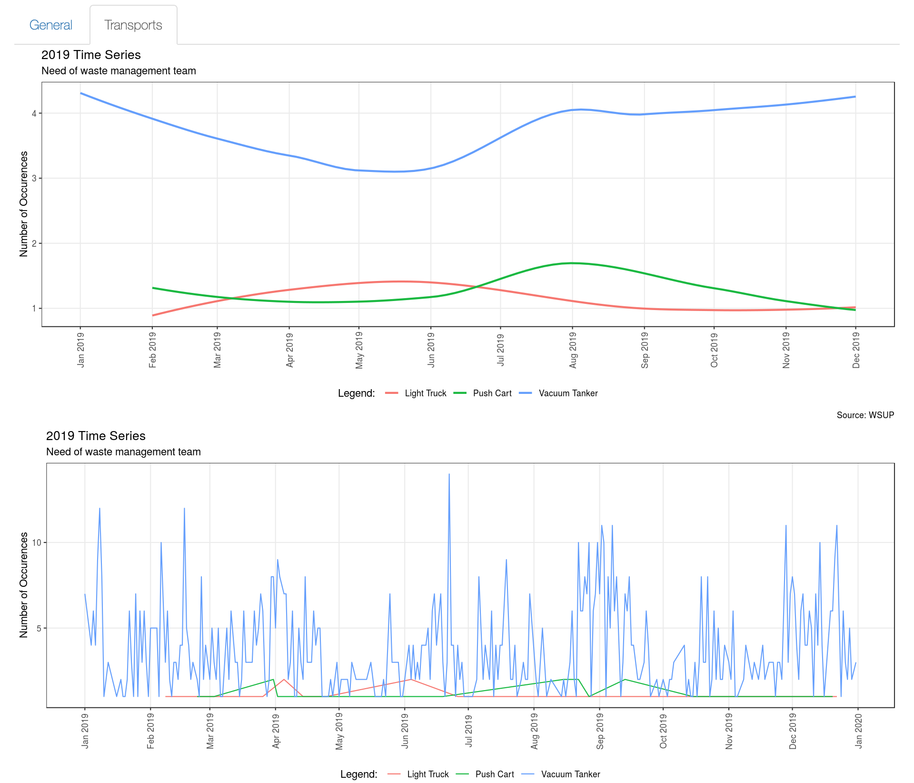
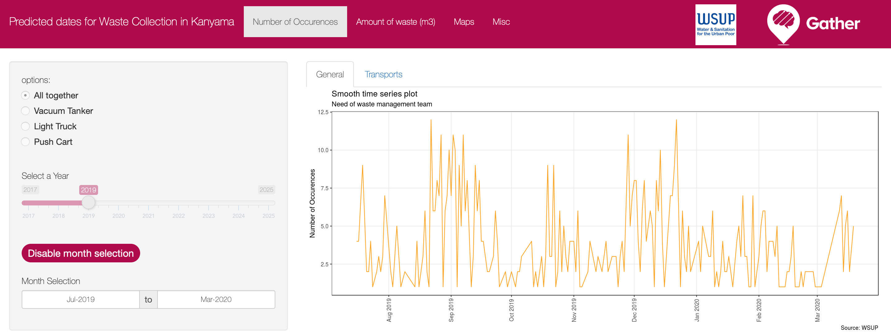
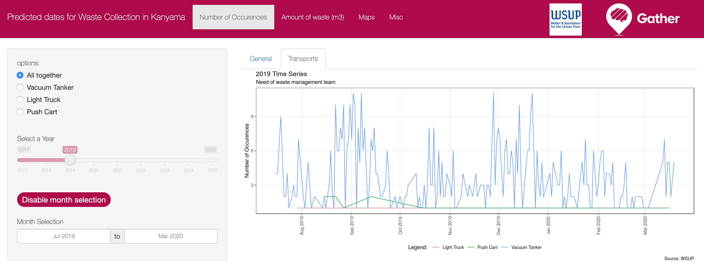
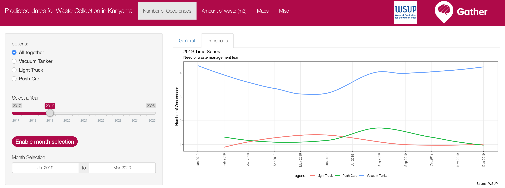
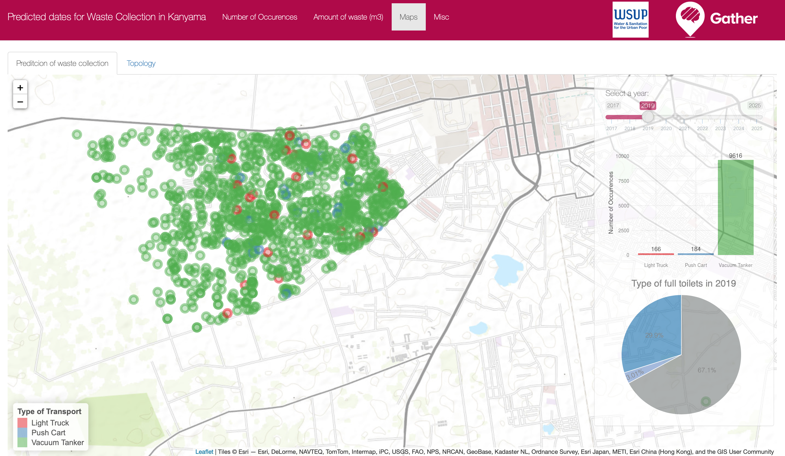

# Predicted dates for Waste Collection in Kanyama

**Structure**:

1. General Description
  - What's the app?
  - What does it basically do?
2. Usage
  - Requirements to run
  - How to run
  - Outcomes
3. Algorithms explanation
4. Next Steps
5. References

***

## General Description

This project is an estimator for when septic tanks and pit latrines will be full by normal usage on Kanyama, one of the Lusaka city compounds, located on the country of Zambia.

The application makes the predictions based on the average daily usage, toilet structure and containment layout. With that it generates the possible dates of when the toilets are going to be full and with that information, providing the contact with the waste management team to operate on these areas, speeding up the process, creating a pattern of colletion and avoiding the spread of sanitation diseases.

## Usage

This application is avaiable at [Gatherhub platform](https://gatherhub.shinyapps.io/shiny/) and totally ready to operate, all the datasets are already included on the application, requiring no more effort from the user.

## User Interface

The "Number of Occurences" tab shows, indicates how many toilets are going to be full on a daily basis, from the day the toilets were last emptied, until the day that they are supposed to be full, according to the calculation. The time-span are by default annual, with a day-by-day(Raw) and monthly (Smooth) aggregation. 

Monthly and Daily Predictions:

Enabling the month selection make the time-span flexible according to the user preference, but only the day-by-day analysis is disponible on this mode. 

General tab with Monhth selection activated:

Accessing the "Transport" sub-tab shows the places that have the respective properties:

1. Vacuum Tanker: Access Available by the Vacuum Tanker
2. Light Truck: Access unavailable by the Vacuum Tanker but available by the Light Truck
3. Push Cart: Access unavailable both by the Light Truck and the Vacuum Tanker

Transport tab with Monhth selection activated:

Transport tab:

The "Amount of Waste" tab works on a similar way, but instead counting toilets this section takes into consideration the containment size on each plot and indicates how many cubic meters has to be collected on each day into the future, making easier for the waste management team to organise its collection approach.

The "Map" tab is responsible to transform the "Number of Occurence"/"Amount of Waste" tabs into a geospatial visualisation, indicating what are the points to be collected and where are the full toilets, The map is zoom sensitive making possible the plots update according to the amount of points on the map.

## Next Steps

This project was an introduction to the WSUP datasets, but to make the project more robust it's still necessary to:

* Add the monthly option on the Maps Tab
* Upgrade the formula to consider water table, weather forecast and flood occurences.
* Upgrade the UI for a more smooth application

